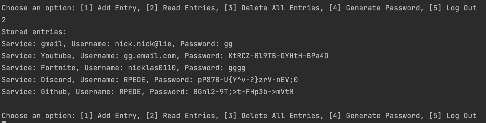
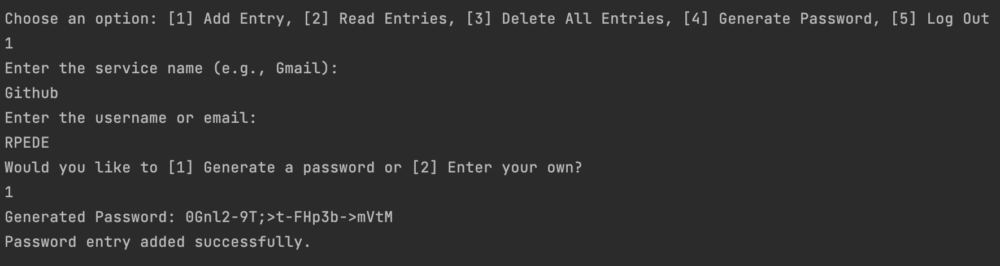

# Secure Password Manager

## Project Overview
This project is a console-based secure password manager implemented in C#. It allows users to securely store and retrieve credentials for various services. Each user has a unique master password for authentication and can add, read, and delete password entries.

## Features
1. **User Management**:
   - Create new users with a master password.
   - Authenticate users with the stored master password.

2. **Password Storage**:
   - Passwords are stored in a local SQLite database (`passwords.db`) located in the project directory.
   - AES-256 encryption is used for securely storing passwords.

3. **Password Management**:
   - Users can add new entries, read existing entries, and delete all entries.
   - Supports password generation in the format: `VVz7Q-W1iwO-6q6&O-,*5$A`, with lowercase and uppercase letters, symbols, and digits.

4. **Security**:
   - Passwords are encrypted using AES-256.
   - Master passwords are hashed using Argon2id before storing in the database.
   - Initialization vectors (IVs) are generated for each encrypted entry to ensure secure encryption.

## Setup Instructions
1. **Prerequisites**:
   - [.NET SDK 8.0+](https://dotnet.microsoft.com/download)
   - [Entity Framework Core](https://docs.microsoft.com/en-us/ef/core/)

2. **Clone the Repository**:
   ```bash
   git clone https://github.com/yourusername/PasswordManager.git
   cd PasswordManager
   ```

3. **Build the Project**:
   ```bash
   dotnet build
   ```

4. **Apply Migrations**:
   Ensure the database schema is up-to-date:
   ```bash
   dotnet ef database update
   ```

5. **Run the Application**:
   ```bash
   dotnet run --project PasswordManager
   ```

6. **Creating a New User**:
   - Choose the option to create a new user.
   - Enter a username and a master password.

7. **Adding a Password Entry**:
   - After logging in, choose the option to add a new entry.
   - Choose whether to generate a password or enter one manually.

8. **Reading and Deleting Entries**:
   - Read stored entries for the logged-in user or delete all entries.

## Screenshots
Below are some screenshots showcasing the functionality of the application:

1. **Main Menu / Logging in**:
   

2. **Password Management**:
   

3. **Adding Password That Is Generated Example**:
   

## Security Model
### Encryption
- **AES-256 Encryption**: All passwords are encrypted using AES-256 before being stored in the database.
- **Unique Initialization Vectors**: An IV is generated for each password entry, ensuring that identical passwords have unique encrypted representations.

### Password Hashing
- **Argon2id**:
   - Argon2id is used for hashing the master password. This algorithm is specifically designed for password hashing and provides resistance against GPU-based brute-force attacks.
   - Argon2id incorporates salts to ensure that even if two users have the same password, their hashes will differ.
   - High memory usage, multiple iterations, and parallelism make Argon2id resistant to brute-force attacks.

### Key Management
- **Master Password**: The master password is hashed using Argon2id and is never stored directly in the database.
- **Key Derivation**: The encryption key for AES-256 is derived directly from the master password and a unique salt using PBKDF2 with 100,000 iterations.

### Database Security
- The database (`passwords.db`) is stored locally in the project directory and contains two main tables:
   - **Users**: Stores usernames and hashed master passwords.
   - **PasswordEntries**: Stores service names, usernames, encrypted passwords, IVs, and user associations.

## Security Discussion

### Cryptographic Decisions and Justifications
- **AES-256 Encryption**: AES-256 provides strong security and is widely trusted in both academic and commercial settings.
- **Argon2id for Hashing**:
   - Argon2id was chosen for its resistance to brute-force and GPU-based attacks. It uses salts, memory-hard functions, and multiple iterations to ensure secure password storage.
- **PBKDF2 for Key Derivation**: The encryption key is derived using PBKDF2 with a high iteration count (100,000), ensuring that even if the salt is exposed, the key derivation process remains computationally expensive for attackers.

### What Does it Protect Against?
The primary goal of the application is to protect stored passwords against unauthorized access. This includes:
- **Local Attacks**: Unauthorized users trying to access the stored passwords without knowing the master password.
- **Data Theft**: Even if the `passwords.db` file is stolen, passwords remain secure because they are encrypted.

### Threat Actors
- **Casual Intruders**: Individuals who gain access to the computer but lack advanced skills.
- **Advanced Attackers**: Skilled attackers who may have access to the database file and attempt to brute-force master passwords.

### Pitfalls and Limitations
- **Local Security**: The application does not protect against keyloggers or malware that can capture keystrokes.
- **Database Security**: If an attacker gains access to the `passwords.db` file and the `salt.dat` file, they may attempt to brute-force the master password.
- **No Multi-Factor Authentication**: The application relies solely on the master password for authentication.

### Future Improvements
- Implement multi-factor authentication for added security.
- Provide a secure backup and restore functionality for encrypted entries.
- Consider adding support for external hardware security keys (e.g., YubiKey).